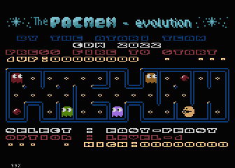
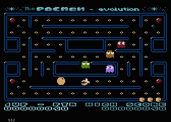

= The Pacmen-evolution

:uri-org: https://github.com/the-atari-team
:uri-repo: {uri-org}/tat.pacmen.evolution
:uri-rel-file-base: link:
:uri-rel-tree-base: link:
ifdef::env-site[]
:uri-rel-file-base: {uri-repo}/blob/master/
:uri-rel-tree-base: {uri-repo}/tree/master/
endif::[]

Here you find the main sources of the Atari 8bit _The Pacmen evolution_.

To simple start the game, take the ATR image file from the release sub-folder.

== Licenses
Some stuff here is downloaded from AtariWiki and is licensed under
https://creativecommons.org/licenses/by-sa/2.5/[Creative Commons Licenses]

== build

To build, stay in root folder and execute `make` from a unix-shell, **but** there are some _preconditions_.
On Windows use git-bash. On Linux the bash.

=== Preconditions to build

You need some stuff for build from scratch

* PC with a unix based environment like Linux or Windows with mingw. I prefer Linux.
* Bash Shell **/bin/bash**
* **make**
- To build this source from scratch
* **OpenJDK 11**
* https://github.com/the-atari-team/lla.xldir.disktool[**lla.xldir.disktool**]
** for read/write access to ATR disk images
* https://github.com/the-atari-team/wnf.compiler[**wnf.compiler**]
** to compile .wnf files to 6502 assembler
* https://github.com/the-atari-team/tat.packer[**tat.packer**]
** to compress the level data by RLE & Huffman
* https://atari.miribilist.com/atasm/[**atasm**] the 6502-cross-assembler, to create COM-files out of ASM-files,
because the wnf.compiler only creates assembler files.
* the http://www.emulators.com/freefile/pcxf380.zip[**ATARIXL.ROM**], copy the XL-OS to `../firmware` folder.
* https://atari800.github.io/index.html[**atari800**] Emulator is need. Make it available via $PATH variable.

If you would like to debug the code, use the https://virtualdub.com/altirra.html[**Altirra**] and start `make debug` on console. In the Makefile find in line 5 the ALTIRRA= expresion, set it to your installed Altirra version. Here you can see how to use it with wine.

